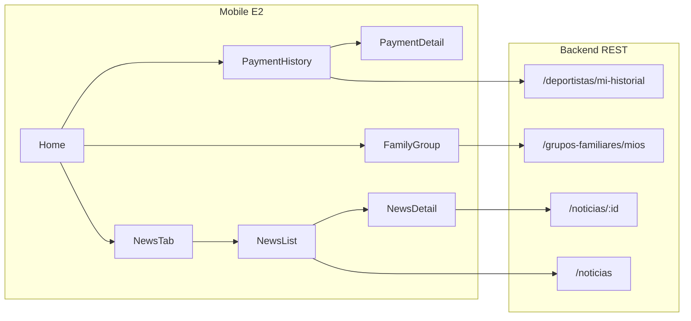

# Plan E2: Historial, Grupo Familiar y Noticias

## Contexto y alcance

El backend ya expone los endpoints requeridos por [docs/doc_tecnica_e2.pdf](docs/doc_tecnica_e2.pdf):

- `GET /deportistas/mi-historial`
- `GET /grupos-familiares/mios`
- `GET /noticias` y `GET /noticias/:id`

**Fuera de alcance:** RF-05 (pago), login, perfil, avisos push, redes sociales, panel web.



---

## Estado actual vs. objetivo

| Módulo | Hoy | Objetivo E2 |
|--------|-----|-------------|
| Historial | [PaymentHistoryScreen.tsx](mobile/src/screens/PaymentHistoryScreen.tsx) parcial: chips de año, dedup, badges; **sin** filtro estado UI, error/retry, pull-to-refresh | RF-08/RF-15 completo |
| Grupo familiar | Placeholder `showComingSoon` en [HomeScreen.tsx](mobile/src/screens/HomeScreen.tsx); servicio básico en [grupoFamiliarService.ts](mobile/src/services/grupoFamiliarService.ts) | RF-12: pantalla de solo lectura |
| Noticias | Tab → [ComingSoonScreen.tsx](mobile/src/screens/ComingSoonScreen.tsx) | RF-13/RF-14: listado + detalle |

---

## Fase 1: Componentes compartidos (opcional pero recomendado)

Crear 2 componentes pequeños en `mobile/src/components/` para cumplir RF-16 sin duplicar lógica en 3 pantallas:

- **`ScreenState.tsx`** (o `EmptyState` + `ErrorState` separados): mensaje + botón "Reintentar" (mín. 48dp táctil).
- **`resolveImageUrl.ts`** en `mobile/src/utils/`: convierte paths relativos (`/uploads/...`) a URL absoluta usando `API_URL.replace(/\/api\/?$/, '')`.

Patrón visual a replicar: header azul `#003366`, cards con [cardShadow.ts](mobile/src/utils/cardShadow.ts), tipografía ≥14sp (como [ProfileScreen.tsx](mobile/src/screens/ProfileScreen.tsx) y [DebtStatusScreen.tsx](mobile/src/screens/DebtStatusScreen.tsx)).

---

## Fase 2: Historial de pagos (completar RF-15)

**Archivo principal:** [mobile/src/screens/PaymentHistoryScreen.tsx](mobile/src/screens/PaymentHistoryScreen.tsx)

Cambios concretos sobre lo ya implementado:

1. **Extraer carga a función `fetchHistorial`** reutilizable (initial load + retry + refresh).
2. **UI filtro por estado:** segunda fila de chips horizontales — Todos / Aprobada / Rechazada / Pendiente. El state `filtroEstado` ya existe; solo falta la UI.
3. **Mensajes vacíos diferenciados** (alcance §4.3):
   - `operaciones.length === 0` → `"No hay pagos registrados."`
   - `operaciones.length > 0 && filtradas.length === 0` → `"No hay pagos para los filtros seleccionados."`
4. **Estado error:** `catch` en fetch → mensaje en español + botón Reintentar.
5. **Pull-to-refresh:** `RefreshControl` en el `ScrollView`.
6. **Etiqueta de sección:** `"Operaciones"` antes del listado (Penpot pantalla 04).
7. **Orden final:** tras deduplicar, ordenar por `(anioCuota, mesCuota)` descendente (referencia: [frontend/src/pages/HistorialPagos.tsx](frontend/src/pages/HistorialPagos.tsx)).

Reglas de negocio ya presentes y a mantener:
- Mapeo `APROBADO→APROBADA`, `RECHAZADO→RECHAZADA`, otro→`PENDIENTE`
- Deduplicación por `mes-anio`: priorizar APROBADA, luego fecha más reciente
- Tap → `navigation.navigate('PaymentDetail', { pagoId })` (sin cambios en [PaymentDetailScreen.tsx](mobile/src/screens/PaymentDetailScreen.tsx))

---

## Fase 3: Grupo familiar (RF-12)

### 3a. Ajuste mínimo en backend

En [backend/src/services/grupoFamiliar.service.ts](backend/src/services/grupoFamiliar.service.ts), en `getByDeportistaId` (y `getById` por consistencia), ampliar el include:

```typescript
deportista: {
  include: {
    disciplina: true,
    categoria: true,  // requerido por alcance §5.2
  },
},
```

Hoy solo trae `disciplina`; sin esto no se puede mostrar categoría en mobile.

### 3b. Tipos y servicio mobile

Extender [mobile/src/services/grupoFamiliarService.ts](mobile/src/services/grupoFamiliarService.ts):

```typescript
integrantes?: Array<{
  esPrincipal?: boolean;
  deportista?: {
    id?: number;
    nombre?: string;
    apellido?: string;
    dni?: string;
    disciplina?: { nombre?: string };
    categoria?: { nombre?: string };
  };
}>;
```

No crear métodos nuevos; `getMios()` ya apunta a `/grupos-familiares/mios`.

### 3c. Pantalla nueva

Crear **`mobile/src/screens/FamilyGroupScreen.tsx`**:

- Header con back + título "Grupo Familiar"
- Estados: loading / error+retry / vacío / datos
- **Con grupo** (`data[0]` — primer elemento de `/mios`):
  - Nombre del grupo + texto `"N integrantes"`
  - Lista de cards por integrante: nombre completo, disciplina, categoría
  - Badge **Titular** si `dni === grupo.titularDni` **o** `esPrincipal === true`; resto **Miembro**
  - Titular con borde destacado `#003366`
- **Sin grupo** (`data: []`): `"No estás registrado en un grupo familiar. Para adherirte, contactate con el club."`
- Nota informativa al pie (como web): contactar al club para adherir integrantes
- Pull-to-refresh

Lógica de titular alineada con [DebtStatusScreen.tsx](mobile/src/screens/DebtStatusScreen.tsx) (líneas 64–70).

### 3d. Navegación

- [mobile/src/navigation/types.ts](mobile/src/navigation/types.ts): agregar `FamilyGroup: undefined` a `RootStackParamList`
- [mobile/src/navigation/AppNavigator.tsx](mobile/src/navigation/AppNavigator.tsx): registrar `FamilyGroupScreen` en el stack
- [mobile/src/screens/HomeScreen.tsx](mobile/src/screens/HomeScreen.tsx): reemplazar `onPress={showComingSoon}` por `navigation.navigate('FamilyGroup')`

---

## Fase 4: Noticias (RF-13 / RF-14)

### 4a. Capa de datos

| Archivo nuevo | Contenido |
|---------------|-----------|
| `mobile/src/types/noticia.ts` | `Noticia { id, titulo, fecha, resumen, contenido, imagenes[], autor? }` — basado en [frontend/src/types/noticia.ts](frontend/src/types/noticia.ts) + campo `autor` del backend |
| `mobile/src/services/noticiaService.ts` | `getAll()` → `GET /noticias`, `getById(id)` → `GET /noticias/:id` — patrón de [frontend/src/services/noticia.service.ts](frontend/src/services/noticia.service.ts) |

### 4b. Listado — tab Noticias

Crear **`mobile/src/screens/NewsListScreen.tsx`**:

- Reemplaza `ComingSoonScreen` en el tab Noticias
- Fetch al montar + pull-to-refresh
- Tarjetas: imagen (`imagenes[0]` vía `resolveImageUrl`) o placeholder Feather `book-open`, fecha `es-AR`, título, resumen (max 3 líneas con `numberOfLines={3}`)
- Vacío: `"No hay noticias publicadas."`
- Error + Reintentar
- Tap → `navigation.navigate('NewsDetail', { noticiaId: id })`

### 4c. Detalle

Crear **`mobile/src/screens/NewsDetailScreen.tsx`**:

- Params: `{ noticiaId: number }`
- Fetch `GET /noticias/:id` al montar
- Muestra: título, fecha, autor (si existe), galería de imágenes, contenido (párrafos por `\n\n`)
- 404 / error: `"Noticia no encontrada"` + botón volver al listado
- Scroll vertical

### 4d. Navegación y Home

- [types.ts](mobile/src/navigation/types.ts): `NewsDetail: { noticiaId: number }`
- [AppNavigator.tsx](mobile/src/navigation/AppNavigator.tsx):
  - Tab `Noticias` → `NewsListScreen`
  - Stack → `NewsDetailScreen`
- [HomeScreen.tsx](mobile/src/screens/HomeScreen.tsx): `"Noticias del club"` → `navigation.navigate('MainTabs', { screen: 'Noticias' })`

`ComingSoonScreen` puede quedar sin uso (no eliminarlo salvo que moleste; no es obligatorio borrarlo).

---

## Fase 5: Verificación manual

Checklist alineado al alcance E2:

| Caso | Resultado esperado |
|------|-------------------|
| Historial con pagos | Chips de año + estado, lista deduplicada, tap abre detalle |
| Historial sin pagos | Mensaje vacío correcto |
| Historial filtros sin match | Mensaje de filtros |
| Historial sin red | Error + Reintentar |
| Grupo con integrantes | Nombre, count, Titular/Miembro, disciplina, categoría |
| Grupo vacío (`[]`) | Mensaje de adhesión al club |
| Noticias listado | Tarjetas ordenadas por fecha desc |
| Noticias vacías | `"No hay noticias publicadas."` |
| Noticia inexistente | `"Noticia no encontrada"` |
| Tab Noticias = menú Home | Misma pantalla de listado |
| 401 en endpoints autenticados | Logout automático (ya en [api.ts](mobile/src/config/api.ts)) |

Probar con backend en la IP de [mobile/.env](mobile/.env) (`EXPO_PUBLIC_API_URL`).

---

## Resumen de archivos

**Crear (mobile):**
- `src/components/ScreenState.tsx` (opcional)
- `src/utils/resolveImageUrl.ts`
- `src/types/noticia.ts`
- `src/services/noticiaService.ts`
- `src/screens/FamilyGroupScreen.tsx`
- `src/screens/NewsListScreen.tsx`
- `src/screens/NewsDetailScreen.tsx`

**Modificar:**
- `mobile/src/screens/PaymentHistoryScreen.tsx`
- `mobile/src/services/grupoFamiliarService.ts`
- `mobile/src/navigation/types.ts`
- `mobile/src/navigation/AppNavigator.tsx`
- `mobile/src/screens/HomeScreen.tsx`
- `backend/src/services/grupoFamiliar.service.ts` (solo include `categoria`)

**No modificar:** `DebtStatusScreen`, `LoginScreen`, `pagoService`, rutas de pago, frontend web.
