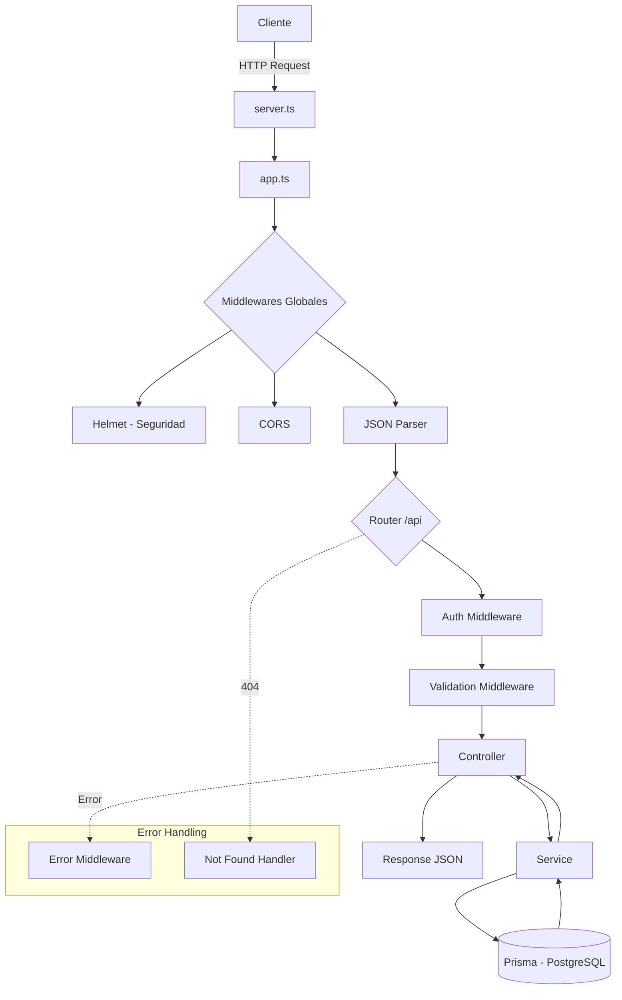
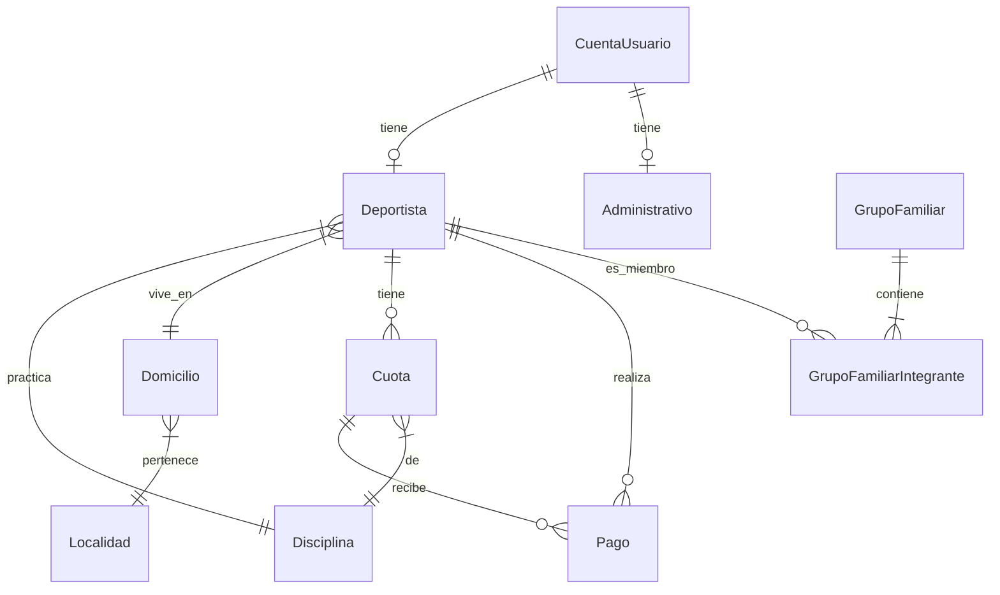
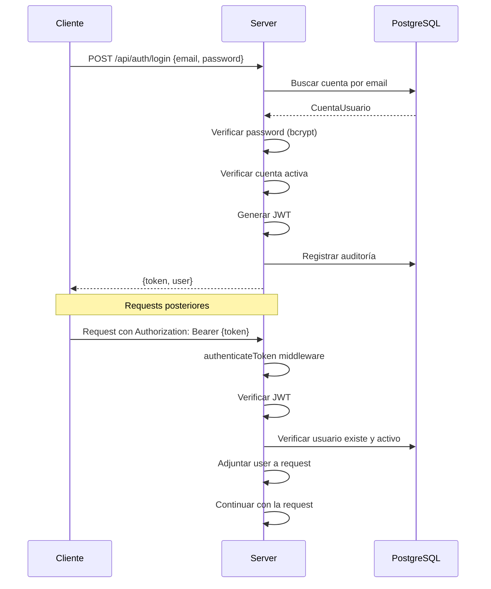

# Flujo del Backend - Forever

Este documento describe la arquitectura y flujo de datos del backend actual.

---

## 📁 Estructura del Proyecto

```
backend/
├── prisma/
│   ├── schema.prisma      # Modelo de datos
│   └── seed.ts            # Script de seed
├── src/
│   ├── config/            # Configuración (env, prisma client)
│   ├── controllers/       # Controladores HTTP
│   ├── middlewares/       # Middlewares de autenticación, validación y errores
│   ├── routes/            # Definición de rutas
│   ├── services/          # Lógica de negocio
│   ├── types/             # Tipos TypeScript
│   ├── utils/             # Utilidades y errores
│   ├── validators/        # Esquemas de validación Zod
│   ├── app.ts             # Configuración de Express
│   └── server.ts          # Punto de entrada
└── package.json
```

---

## 🔄 Flujo de una Request



---

## 🛡️ Middlewares

### 1. `auth.middleware.ts`
| Función | Descripción |
|---------|-------------|
| `authenticateToken` | Valida JWT, verifica usuario activo/no bloqueado |
| `requireAdmin` | Requiere rol `ADMIN` |
| `requireAdministrativo` | Requiere rol `ADMIN` o `ADMINISTRATIVO` |
| `requireDeportista` | Requiere rol `DEPORTISTA` |
| `requireSelfOrAdmin` | Permite acceso al propio recurso o si es admin |

### 2. `validation.middleware.ts`
| Función | Descripción |
|---------|-------------|
| `validate({body?, params?, query?})` | Valida usando esquemas Zod |
| `validateBody(schema)` | Shorthand para validar body |
| `validateParams(schema)` | Shorthand para validar params |
| `validateQuery(schema)` | Shorthand para validar query |

### 3. `error.middleware.ts`
| Función | Descripción |
|---------|-------------|
| `errorHandler` | Maneja errores de app, Prisma y genéricos |
| `notFoundHandler` | Responde 404 para rutas no encontradas |

---

## 🛣️ Rutas API

Todas las rutas están bajo el prefijo `/api`.

| Prefijo | Archivo | Descripción |
|---------|---------|-------------|
| `/auth` | `auth.routes.ts` | Autenticación (login, register, me) |
| `/users` | `user.routes.ts` | Gestión de usuarios |
| `/deportistas` | `deportista.routes.ts` | CRUD deportistas |
| `/cuotas` | `cuota.routes.ts` | Gestión de cuotas |
| `/pagos` | `pago.routes.ts` | Gestión de pagos |
| `/disciplinas` | `disciplina.routes.ts` | CRUD disciplinas |
| `/grupos-familiares` | `grupoFamiliar.routes.ts` | Grupos familiares |

### Endpoints Principales

#### Auth (`/api/auth`)
| Método | Ruta | Auth | Rol | Descripción |
|--------|------|------|-----|-------------|
| POST | `/login` | ❌ | - | Iniciar sesión |
| POST | `/register` | ✅ | ADMIN | Registrar usuario |
| GET | `/me` | ✅ | - | Obtener usuario autenticado |

#### Deportistas (`/api/deportistas`)
| Método | Ruta | Auth | Rol | Descripción |
|--------|------|------|-----|-------------|
| GET | `/` | ✅ | ADMINISTRATIVO | Listar deportistas |
| POST | `/` | ✅ | ADMINISTRATIVO | Crear deportista |
| GET | `/:id` | ✅ | ADMINISTRATIVO | Obtener por ID |
| PUT | `/:id` | ✅ | ADMINISTRATIVO | Actualizar |
| DELETE | `/:id` | ✅ | ADMINISTRATIVO | Eliminar |
| GET | `/mi-perfil` | ✅ | DEPORTISTA | Perfil propio |
| GET | `/mi-historial` | ✅ | DEPORTISTA | Historial propio |
| GET | `/pagos-pendientes` | ✅ | ADMINISTRATIVO | Deportistas con deuda |
| GET | `/:id/historial` | ✅ | ADMINISTRATIVO | Historial por ID |

---

## 🗃️ Modelo de Datos (Prisma)

### Enums
| Enum | Valores |
|------|---------|
| `Rol` | ADMIN, ADMINISTRATIVO, DEPORTISTA |
| `EstadoDeportista` | EN_DEUDA, AL_DIA, MOROSA, INACTIVA |
| `EstadoCuota` | PAGADA, PENDIENTE, VENCIDA |
| `EstadoPago` | APROBADO, RECHAZADO, PENDIENTE |
| `Periodicidad` | MENSUAL, ANUAL |
| `Vinculo` | PADRE, MADRE, HIJO, HERMANO, OTRO |

### Entidades Principales



#### Tablas
| Modelo | Tabla | Descripción |
|--------|-------|-------------|
| `CuentaUsuario` | `cuentas_usuario` | Autenticación y roles |
| `Administrativo` | `administrativos` | Perfil de admin/administrativo |
| `Deportista` | `deportistas` | Perfil de deportista |
| `Disciplina` | `disciplinas` | Deportes/actividades |
| `Cuota` | `cuotas` | Cuotas mensuales |
| `Pago` | `pagos` | Pagos realizados |
| `GrupoFamiliar` | `grupos_familiares` | Grupos familiares |
| `GrupoFamiliarIntegrante` | `grupo_familiar_integrantes` | Relación grupo-deportista |
| `Localidad` | `localidades` | Ciudades/localidades |
| `Domicilio` | `domicilios` | Direcciones |
| `AuditoriaAcceso` | `auditoria_accesos` | Log de accesos |
| `AuditoriaCambios` | `auditoria_cambios` | Log de cambios |

---

## 🔐 Flujo de Autenticación



---

## 🧱 Patrón Controller → Service → Prisma

Cada entidad sigue el patrón:

1. **Route**: Define endpoints y aplica middlewares
2. **Controller**: Recibe request, llama al service, envía response
3. **Service**: Contiene lógica de negocio, interactúa con Prisma
4. **Validator**: Define esquemas Zod para validación

### Ejemplo: Crear Deportista

```
POST /api/deportistas
  ↓
[authenticateToken] → Verifica JWT
  ↓
[requireAdministrativo] → Verifica rol
  ↓
[validateBody(createDeportistaSchema)] → Valida datos
  ↓
deportistaController.create()
  ↓
deportistaService.create(data)
  ↓
prisma.deportista.create({...})
  ↓
Response JSON { success: true, data: {...} }
```

---

## 📦 Dependencias Principales

| Paquete | Uso |
|---------|-----|
| `express` | Framework HTTP |
| `@prisma/client` | ORM para PostgreSQL |
| `jsonwebtoken` | Autenticación JWT |
| `bcryptjs` | Hash de passwords |
| `zod` | Validación de datos |
| `helmet` | Headers de seguridad |
| `cors` | Configuración CORS |
| `mercadopago` | Integración de pagos |
| `nodemailer` | Envío de emails |

---

## 🚀 Scripts de Ejecución

```bash
npm run dev              # Desarrollo con hot-reload
npm run build            # Compilar TypeScript
npm start                # Producción
npm test                 # Tests unitarios
npm run test:integration # Tests de integración
npm run prisma:migrate   # Migraciones
npm run prisma:seed      # Seed de datos
npm run prisma:studio    # UI de Prisma
```
