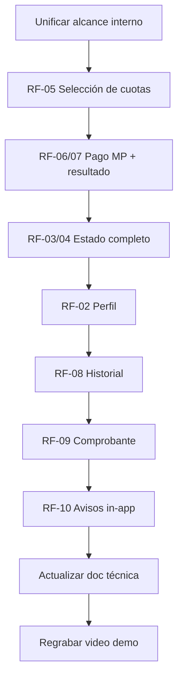

# Contradicciones en el alcance del proyecto
_Exported on 6/9/2026 at 11:54:19 GMT-3 from Cursor (3.7.19)_

---

**User**

El comentario de los profesores señala una *contradicción crítica* entre lo que el grupo prometió entregar por escrito y lo que realmente presentó en el video y el código. Básicamente, les están diciendo que su *documento de alcance es mucho más ambicioso de lo que la aplicación realmente hace hoy*.

Aquí te explico detalladamente los puntos donde fallaron según la corrección y las fuentes:

### 1. Inconsistencia entre el Alcance y la Realidad
El documento *"alcance_e1_app_movil.pdf"* declara explícitamente que los requerimientos *del RF-01 al RF-11* son parte de la *Entrega 1 (E1)*. Sin embargo:
*   En el video demo, ustedes mencionan que "en esta sprint *lo único que desarrollamos fue el módulo de estado de deuda*".
*   En el mismo video, presentan como "próximas funcionalidades" (es decir, no realizadas) el historial de pagos, grupo familiar, noticias y perfil.
*   *El error:* Si el documento de alcance dice que esas funciones son para la *E1*, los profesores esperan verlas terminadas en esta entrega, no como planes a futuro.

### 2. El ejemplo del RF-05 (Selección de cuotas)
Los profesores detectaron que este requerimiento específico no se cumple en la aplicación actual:
*   *Lo que prometieron (RF-05):* "La app debe permitir *seleccionar una o varias cuotas* pendientes para abonarlas en una sola transacción".
*   *Lo que muestra la app:* Según las capturas y la documentación técnica, la pantalla de "Estado de Deuda" muestra un *"Total adeudado"* de $14.500 y un botón directo de *"Pagar con Mercado Pago"*. 
*   *Dónde fallaron:* No existe una interfaz (como cuadritos para marcar o "checkboxes") que permita al usuario elegir, por ejemplo, pagar solo la cuota de "Marzo" y dejar "Abril" para después. La aplicación parece obligar a pagar el total o no permite la selección individual que prometieron en el requerimiento.

### 3. Incumplimiento del Video Demo
La corrección indica que el video debe cubrir *todos* los requerimientos funcionales y no funcionales definidos:
*   Su documento de alcance lista 11 requerimientos funcionales para la E1. 
*   El video solo demuestra el *RF-01* (Login), *RF-03* (Estado de cuenta) y *RF-06* (Inicio de pago). 
*   Faltan demostraciones de requerimientos que ustedes mismos marcaron como E1, como el *RF-02* (Perfil), *RF-08* (Historial de pagos), *RF-09* (Descarga de comprobantes) y *RF-10* (Notificaciones).

### 4. Contradicción entre sus propios documentos
Existe un problema de coordinación interna en el grupo:
*   Mientras que el *Documento de Alcance* dice que casi todo es *E1, su **Documentación Técnica* admite que "las pantallas de historial, noticias, perfil y grupo familiar *quedan fuera del alcance de esta entrega*". 
*   *Por qué está mal:* Para los profesores, el documento de referencia principal es el de *Alcance*. Si ahí dicen que algo se entrega en la E1, debe estar en el video y en el código.

Tengo estos problemas necesito resolverlos utiliza estos archivos para darte contexto: 
@docs/alcance_e1_app_movil.pdf @docs/doc_tecnica_e1.pdf 


---

**Cursor**

Voy a revisar los documentos de alcance y técnica, y contrastarlos con lo que hay implementado en el código.


Los profesores tienen razón: hay una contradicción real y documentada entre lo que prometieron y lo que entregaron. Te detallo el diagnóstico y un plan concreto para resolverlo.

## Diagnóstico: qué prometieron vs. qué existe hoy

### Documento de Alcance (`alcance_e1_app_movil.pdf`) — la referencia que usan los profesores

Marca **RF-01 a RF-11 como E1**. El resumen de la sección 5 dice explícitamente:

> *"autenticarse, consultar cuotas, **seleccionar cuotas**, iniciar pago online, visualizar resultado, consultar historial y recibir avisos básicos"*

Solo **RF-12** (grupo familiar) queda en backlog E2.

### Documentación Técnica (`doc_tecnica_e1.pdf`) — contradice al alcance

En la página 4 admite que historial, noticias, perfil y grupo familiar **quedan fuera de E1**, y en la página 3 dice que en E1 solo es funcional el flujo **Login → Home → Estado de deuda → Pago**.

Eso es coherente con el código actual, pero **no** con el documento de alcance.

### Código móvil actual — alineado con la doc técnica, no con el alcance

La navegación solo tiene 3 pantallas:

```21:35:c:\Users\famil\Documents\Facultad\4to año\App Moviles\forever\mobile\src\navigation\AppNavigator.tsx
function AppNavigatorStack() {
  return (
    <AppStack.Navigator>
      <AppStack.Screen
        name="Home"
        component={HomeScreen}
        options={{ title: 'Inicio' }}
      />
      <AppStack.Screen
        name="DebtStatus"
        component={DebtStatusScreen}
        options={{ headerShown: false }}
      />
    </AppStack.Navigator>
  );
}
```

`HomeScreen` solo ofrece "Estado de deuda" y "Cerrar sesión" — sin perfil, historial ni notificaciones.

---

## Mapa RF por RF: estado real

| RF | Requerimiento | Estado en la app móvil | Evidencia |
|:---|:---|:---|:---|
| **RF-01** | Login | ✅ Implementado | `LoginScreen` + `AuthContext` |
| **RF-02** | Perfil | ❌ No hay pantalla | Existe `GET /deportistas/mi-perfil` y `deportistaService.getMiPerfil()`, pero no hay `ProfileScreen` en navegación |
| **RF-03** | Estado de cuenta (pagadas, pendientes, vencidas) | ⚠️ Parcial | Muestra pendientes/vencidas; **no muestra cuotas pagadas** (el API las devuelve en `cuotasPagadas`, pero mobile no las usa) |
| **RF-04** | Detalle de cada cuota | ⚠️ Parcial | Muestra mes, monto, estado; falta vencimiento explícito, categoría y disciplina (backend no la incluye en `/cuotas/mi-estado`) |
| **RF-05** | Seleccionar una o varias cuotas | ❌ No cumplido | `CuotaCard` es solo visual; botón paga el **total** sin checkboxes. Además, backend acepta **una sola** `cuotaId` por pago |
| **RF-06** | Iniciar pago con Mercado Pago | ❌ Stub | El botón muestra un alert de "próximamente" |
| **RF-07** | Resultado del pago | ❌ No implementado | Sin pantalla de resultado ni manejo de estados |
| **RF-08** | Historial de pagos | ❌ No en mobile | Existe en web (`HistorialPagos.tsx`) y API (`/deportistas/mi-historial`, `/pagos/mis-pagos`), pero no hay pantalla mobile ni servicio |
| **RF-09** | Comprobante | ❌ No implementado | No hay endpoint ni UI de comprobante |
| **RF-10** | Notificaciones/avisos | ❌ No implementado | Sin push ni bandeja de avisos in-app |
| **RF-11** | Cerrar sesión | ✅ Implementado | Botón en `HomeScreen` + `logout()` en `AuthContext` |

### RF-05: el caso más claro

```152:157:c:\Users\famil\Documents\Facultad\4to año\App Moviles\forever\mobile\src\screens\DebtStatusScreen.tsx
  const handlePayMercadoPago = () => {
    Alert.alert(
      'Pagar con Mercado Pago',
      'La integración con Mercado Pago estará disponible próximamente.',
    );
  };
```

No hay estado `selectedCuotas`, ni checkboxes, ni recálculo del monto según selección. El backend también limita el pago a una cuota:

```4:9:c:\Users\famil\Documents\Facultad\4to año\App Moviles\forever\backend\src\validators\pago.validator.ts
export const createPagoSchema = z.object({
  cuotaId: z
    .number({ message: 'La cuota es requerida' })
    .int()
    .positive('ID de cuota invalido'),
```

Para cumplir RF-05 al pie de la letra ("varias cuotas en una sola transacción") haría falta cambio en backend + mobile.

### RF-06/07: gap también en backend

El backend crea un registro de pago (`POST /api/pagos/crear`) y tiene webhook, pero **no genera preferencia/checkout de Mercado Pago** (no hay `init_point` ni integración con la API de MP). Las variables de entorno existen, pero la integración real no está terminada.

---

## Por qué los profesores marcaron la contradicción

Hay **tres versiones distintas del alcance** en el grupo:

1. **Alcance E1** → RF-01 a RF-11 = entrega completa  
2. **Doc técnica** → MVP mínimo (login + deuda + pago)  
3. **Video demo** → "solo desarrollamos el módulo de estado de deuda"

Para los profesores, el documento de alcance es el contrato. Si ahí dice E1, deben verlo en **código + video + documentación técnica alineada**.

---

## Cómo resolverlo: dos caminos

### Camino A — Alinear documentos a la realidad (más rápido, menos trabajo de código)

Si no alcanza el tiempo para implementar todo:

1. **Actualizar `alcance_e1_app_movil.pdf`** moviendo a backlog E2 lo que no está hecho (perfil, historial, comprobantes, notificaciones push, pago múltiple).
2. **Dejar en E1 solo** lo que realmente funciona o van a terminar antes de la reentrega.
3. **Unificar la doc técnica** para que coincida palabra por palabra con el alcance revisado.
4. **Regrabar el video** sin decir "próximas funcionalidades" para cosas que sigan en E1.

Riesgo: si la fecha de corrección ya pasó, puede que no acepten cambiar el alcance retroactivamente. Conviene consultar con los profesores si permiten una **addendum de alcance** justificando el recorte.

### Camino B — Cumplir el alcance original (lo que los profesores esperan)

Prioridad sugerida según impacto en la corrección:

#### Prioridad 1 — Crítico (cierra las objeciones principales)

1. **RF-05**: Checkboxes en `DebtStatusScreen`, monto dinámico según selección, botón "Pagar seleccionadas".
   - Mínimo viable: selección de **una** cuota (ya alineado con el backend actual).
   - Ideal según alcance: varias cuotas → extender `createPagoSchema` a `cuotaIds: number[]` y sumar montos.

2. **RF-06 + RF-07**: Flujo de pago real.
   - Backend: endpoint que cree preferencia MP y devuelva `init_point`.
   - Mobile: `Linking.openURL()` o `expo-web-browser` para abrir checkout.
   - Pantalla/modal de resultado: aprobado / pendiente / rechazado / sin conexión.

3. **RF-03 + RF-04**: Mostrar también `cuotasPagadas` y fecha de vencimiento en cada tarjeta.

#### Prioridad 2 — Requerimientos que faltan en el video

4. **RF-02**: `ProfileScreen` consumiendo `/deportistas/mi-perfil` (la web ya lo hace).
5. **RF-08**: `PaymentHistoryScreen` consumiendo `/deportistas/mi-historial` (copiar lógica de `HistorialPagos.tsx`).
6. **RF-09**: En detalle de pago, botón "Ver comprobante" (puede ser PDF del club o link de MP si existe `mercadoPagoId`).

#### Prioridad 3 — RF-10 (el más flexible)

7. **RF-10**: Avisos in-app mínimos:
   - Banner en Home si hay cuotas vencidas o por vencer (sin push).
   - Lista simple de "avisos" derivados del estado de cuenta.
   - Push notifications completas pueden quedar para E2 si el alcance lo permite.

#### Prioridad 4 — Documentación y video

8. **Actualizar `doc_tecnica_e1.pdf`** para que liste las 11 pantallas/flujos de E1.
9. **Regrabar video** con guion por RF (ver checklist abajo).
10. **Eliminar del video** frases como "solo desarrollamos estado de deuda" o "próximamente" para RF de E1.

---

## Checklist para el nuevo video demo

Cada RF debería tener **15–30 segundos** de demostración explícita:

| Segmento | Qué mostrar |
|:---|:---|
| RF-01 | Login con DNI/contraseña, error si credenciales inválidas |
| RF-02 | Pantalla perfil: nombre, DNI, disciplina, contacto |
| RF-03 | Estado de cuenta con pagadas + pendientes + vencidas |
| RF-04 | Detalle de cuota: período, disciplina, vencimiento, monto, estado |
| RF-05 | Marcar 1 cuota (o 2), ver monto actualizado, confirmar selección |
| RF-06 | Tap en pagar → abre Mercado Pago (o simulación con sandbox) |
| RF-07 | Pantalla de resultado según estado del pago |
| RF-08 | Historial con fecha, monto, período, estado |
| RF-09 | Abrir/descargar comprobante de un pago aprobado |
| RF-10 | Aviso de cuota vencida o por vencer visible en la app |
| RF-11 | Cerrar sesión y verificar que no se accede sin login |
| RNF-03 | Sin internet → mensaje claro, sin iniciar pago |
| RNF-06 | Interfaz en español |

---

## Plan de trabajo sugerido por sprint (si eligen Camino B)



**Orden recomendado de implementación en código:**

1. Selección de cuotas en `DebtStatusScreen`
2. Servicio `pagoService` en mobile + integración MP en backend
3. Pantalla resultado de pago
4. `ProfileScreen` + `PaymentHistoryScreen` en `AppNavigator`
5. Sección de cuotas pagadas en estado de cuenta
6. Avisos in-app básicos
7. Comprobante (puede ser MVP: mostrar datos del pago como "comprobante")

---

## Qué reutilizar del proyecto web

Ya tenéis referencias implementadas en `frontend/`:

- `DebtStatus.tsx` — lógica de cuotas (aunque pago individual, no múltiple)
- `HistorialPagos.tsx` — historial completo con filtros
- Servicios en `deportista.service.ts` — `getMiPerfil`, `getMiHistorial`

La estrategia más eficiente es **portar esas pantallas a React Native**, no reescribir desde cero.

---

## Recomendación final

La corrección no es solo de código: es de **gobernanza de alcance**. Antes de programar:

1. El grupo debe decidir **una sola fuente de verdad** (recomiendo mantener RF-01 a RF-11 en E1 si los profesores no aceptan recorte).
2. La doc técnica debe decir lo mismo que el alcance.
3. El video debe demostrar **cada RF marcado como E1**, sin presentar funcionalidades de E1 como "futuro".

Si querés que implemente estos cambios en el código (selección de cuotas, pantallas faltantes, pago MP, etc.), cambiá a **modo Agent** y podemos atacar el plan por prioridades. También puedo ayudarte a redactar el addendum de alcance o el guion del video si preferís seguir en Ask mode.

---

**User**

Haz un plan para todo esto.

---

**Cursor**

Revisando el código y la documentación para armar un plan concreto que cierre las brechas del alcance E1.


**Decisiones que cambian el plan**

> **RF-05 pide pagar una o varias cuotas en una sola transacción. El backend hoy solo acepta una cuotaId por pago. ¿Qué alcance de implementación prefieren?**
> - Completo: selección múltiple + una sola preferencia/checkout de Mercado Pago (requiere cambios en backend y schema)
> - Intermedio: UI con checkboxes y monto dinámico, pero crear un pago por cuota seleccionada (más simple, cumple parcialmente RF-05)
> - Mínimo: seleccionar solo una cuota a la vez (menos trabajo, pero no cumple el texto literal del RF-05) ✔

> **Para RF-06/RF-07 (pago con Mercado Pago), ¿qué nivel de integración necesitan para la reentrega?**
> - Integración real con Mercado Pago Sandbox (checkout + webhook + pantalla de resultado)
> - Flujo simulado para demo académica (crear pago en backend + pantalla de resultado mock, sin checkout real)
>
> Answer: Integracion real con Mercado Pago, utilizando lo que ya esta en la aplicacion de escritorio

Confirmado: la web tampoco tiene checkout de Mercado Pago; el plan incluirá construir esa integración en el backend compartido.


---

**User**

Fase 9: Video demo y verificación final

Guion del video (cubrir todos los RF de E1)
Quita esto

---

**Cursor**

Voy a quitar la Fase 9 del plan y ajustar referencias y todos relacionados.


Actualicé el plan con estos cambios:

- **Eliminada** por completo la Fase 9 (guion del video, tabla de RF y checklist de verificación final).
- **Overview** sin mención al video.
- **Todo** `video-docs-final` reemplazado por `docs-api-guide` (solo actualizar `API_TESTING_GUIDE` con `checkoutUrl`).
- **Camino crítico** y diagrama Gantt ajustados: cierre = documentación técnica, no video.
- **Fase 8** reescrita para hablar de paridad web/mobile, sin referencia al video.

El plan queda en **8 fases de implementación** (0 a 8), más documentación y API guide como cierre técnico. Si querés seguir ajustando el plan o empezar a ejecutarlo, decime.

---

**User**

Implement the plan as specified, it is attached for your reference. Do NOT edit the plan file itself.

To-do's from the plan have already been created. Do not create them again. Mark them as in_progress as you work, starting with the first one. Don't stop until you have completed all the to-dos.

---

**Cursor**

Implementando el plan completo: empezando por la documentación y el backend (bloqueante), luego la app móvil.


Creando la documentación y el backend de Mercado Pago en paralelo.


Implementación del plan completada. Resumen de lo entregado:

## Backend

- **`mercadopago.service.ts`**: creación de preferencias MP; modo simulado sin token (redirect a `/api/pagos/simular-retorno`).
- **`POST /api/pagos/crear`**: devuelve `pago`, `checkoutUrl`, `publicKey` y `preferenceId`.
- **Webhook**: consulta estado real en MP y confirma por `external_reference` (pagoId).
- **`GET /api/pagos/simular-retorno`**: simula pago en dev y redirige a `forever://payment/result` en mobile.
- **`GET /api/cuotas/mi-estado`**: incluye `disciplina` y `anio` en cuotas pagadas/pendientes.
- **`GET /api/deportistas/mi-historial`**: incluye `linkComprobante` y `mercadoPagoId`.
- **`GET /api/pagos/:id`**: el deportista solo ve sus propios pagos.

## Mobile (RF-01 a RF-11)

| RF | Implementación |
|----|----------------|
| RF-01 | Login (ya existía) |
| RF-02 | `ProfileScreen` |
| RF-03/04 | `DebtStatusScreen` con pagadas + pendientes + vencimiento |
| RF-05 | Selección de **una** cuota con radio |
| RF-06/07 | `pagoService` + checkout MP + `PaymentResultScreen` |
| RF-08 | `PaymentHistoryScreen` |
| RF-09 | `PaymentDetailScreen` con comprobante |
| RF-10 | `AvisosBanner` en Home |
| RF-11 | Cerrar sesión en Home |

- Menú en **Home** (Perfil, Deuda, Historial).
- Deep link `forever://` en `app.json`.
- Dependencia **`expo-web-browser`** instalada.

## Web + docs

- **`frontend/src/services/pago.service.ts`** y `DebtStatus.tsx` conectados al mismo flujo de pago.
- **`docs/doc_tecnica_e1.md`** y **`docs/addendum_alcance_rf05.md`** alineados con el alcance.
- **`API_TESTING_GUIDE.md`** actualizado con `checkoutUrl`.

## Cómo probar el pago (sin credenciales MP)

1. Backend en `localhost:3000`.
2. Login deportista en la app.
3. Estado de Deuda → seleccionar cuota → Pagar.
4. Se abre la simulación, confirma el pago y vuelve a la app con el resultado.

## Con Mercado Pago Sandbox real

Configurar en `.env` del backend:

```
MERCADOPAGO_ACCESS_TOKEN=TEST-...
MERCADOPAGO_PUBLIC_KEY=TEST-...
MERCADOPAGO_WEBHOOK_URL=https://<tu-ngrok>/api/pagos/webhook
```

Los `back_urls` por defecto usan `forever://payment/result?pagoId=...`.

